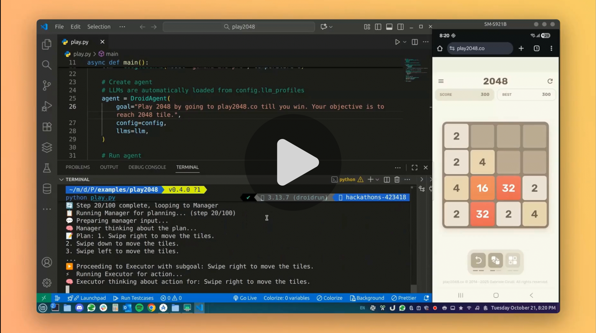

# play2048

An automated agent that plays the 2048 game on play2048.co, attempting to reach the 2048 tile using strategic moves.

## Demo
[](https://x.com/droid_run/status/1980861753803305166)

## Usage

Install dependencies
```bash
pip install -r requirements.txt
```
Set environment variable `GEMINI_API_KEY`

```bash
export GEMINI_API_KEY="your_api_key_here"
```

Run the agent with:

```bash
python play.py
```

The agent will:
- Navigate to play2048.co
- Analyze the game board
- Make strategic moves to combine tiles
- Continue playing until reaching the 2048 tile or completing the configured maximum steps

## Configuration

The agent uses DroidRun's configuration with:
- Maximum steps: 100
- Reasoning enabled for better decision-making
- Trajectory logging enabled to track actions

Run histories and screenshots will be saved in the `trajectories/` directory.
